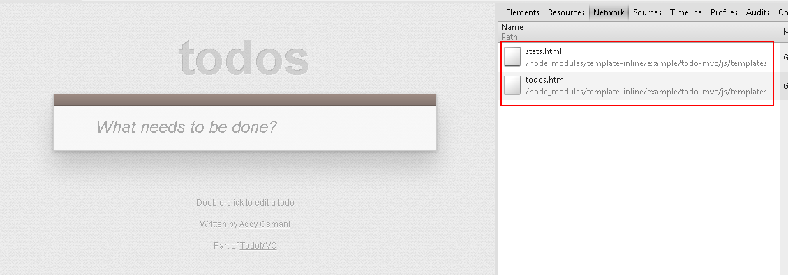

Grunt Plugin:   template-inline
===============

Grunt task for embedding html template as base64 or  encodeURIComponent inside your js.

####插件使用参见： 

example/todoMvc的grunt配置

#####效果：

如图所示，没有使用插件时，会加载模板文件。使用插件不会加载模板文件。

##### 使用方式

1.参见：代码下的TodoMVC的grunt配置

2.原来的requirejs中的 **"text!xxx/yyy.html"会被编译成  "tplin!html内容编码"。** TodoMVC中的Rrequirejs的目录中有个tplin文件，改动代码，根据编码方式进行解码实现。
	
	注：html内容编码为读取的html的内容，根据编码方式配置生成编码后的内容。
	目前支持base64，encodeURIComponent编码
	
	

	
	

###### 插件背景

	在 Single Page App（SPA）的大型项目中，我们一般会使用requirejs/seajs，结合类似Backbone的前端MVC框架 来组织模块化开发。但随着项目的模块复杂度越高，模块切分的越细，模板文件的数量也随着增多，即意味着页面请求时模板请求数增多。如果不做有些组织优化，一个模块的请求为2（VIEW_JS,VIEW_Template）。n个模块即是 2n的文件请求。

	一般前端静态文件的优化的第一步常以 合并请求、 压缩字节这两种方式。
	
	在应用requirejs/seajs的项目中，其自身提供的文件压缩方案，一般按照其文件的Require依赖。用过requirejs自身提供的 r.js 的压缩，或者seajs的自身的压缩机制，根据依赖压缩合并成一个文件。
	
	而Single Page App（SPA）的大型项目中，合并成一个文件是不可行的，根据依赖的压缩过程相对复杂，也有很多问题。项目大的话，单个入口配置合并起来少则400-500k，多则以mb计。多个入口配置,则会存在同一份模块代码存在于不同的release文件中的问题。这个问题在传统非SPA的项目优化中也存在。

	合并多个文件的请求输出压缩合并后的文件的方式的对立面是 无法享用单个模块文件的缓存带来的复用。

	
#### SPA的项目的特点：

	每次只加载局部的模块，不需要重新刷新整个页面。因此，应尽量减少在每次的点击操作中加载的请求和字节，并使用缓存所带来的资源复用。

####Single Page App（SPA）性能优化思考：

**1、合并局部的请求，压缩字节**
 
	- 内嵌img到css中 （grunt插件：grunt-image-embed）
	- 内嵌View的模板到js中（插件：template-inline）
	- 编译元模块，对外输出为一个文件

	在完成局部的请求合并后，再应用uglify等压缩工具进行字节的压缩。

**2、预加载资源**

	
	这个其实是个简单粗暴的提升用户的性能体验的方式。但个人感觉这是一个不错的方式。

	绝大多移动的HTML/HTML5游戏都是利用Android/Ios提供的资源管理方式预先打包在客户端,或者进行预加载并存储所需的资源。

	对于非客户端的SPA的项目，进行资源的预加载，这样在使用过程中，只有数据请求，静态资源（css，js，img）的请求都以缓存的方式存在了。

	预加载是简单实用的方式，但预加载资源实现相对简单，但目前貌似没有成熟的控制JS,CSS的不解析不渲染的方案。

	预加载的思路：
	常采用的方式主要如这里介绍的： http://www.cnblogs.com/_franky/archive/2010/12/09/1901720.html
	
	但目前业内没有广泛推广的成熟方式，估计应用预加载的单页面程序也不多。

### 项目中的grunt配置供参考构建应用思路：

  
	module.exports = function(grunt) {
	    "use strict";
	    var jsFiles = [
	        'js/app/**/*.js',
	        'js/model/**/*.js',
	        'js/module/**/*.js',
	        'js/view/**/*.js'
	    ];
	
	    grunt.initConfig({
	        jshint: {
	            files: jsFiles
	        },
	        templateInline: {
	
	            tpl: {
	
	                files : [
	                    {
	                        expand: true,
	                        cwd : 'js/',
	                        src : ['*/**/*.js','!lib/comb.src/*.js'],
	                        filter : 'isFile',
	                        dest : '.tplin/'
	                    }
	                ],
	
	                options: {
	                    baseDir: "js/",
	                    type:"base4" //base4 or uri
	                }
	            }
	          
	        },
	        compass: {
	            compile: {
	                options: {
	                    sassDir: 'sass',
	                    cssDir: 'css',
	                    environment: 'production'
	                }
	            }
	        },
	        clean: {
	            css: [ 'css/*.css'] ,
	            dist: [ 'dist/' ],
	            tplin: [ '.tplin/' ]
	        },
	        uglify : {
	            options: {
	                mangle: {
	                    except: ['require','exports','requirejs']
	                }
	            },
	            build: {
	              files:  [
	                  {
	
	                    expand: true,
	                    cwd:'.tplin/',
	                    src : ['**/*.js'],
	                    dest: 'dist/'
	                  }
	              ]
	
	            }
	        }
	    });
	
	
	
	
	
	    grunt.loadNpmTasks('grunt-contrib-mincss');
	    grunt.loadNpmTasks('grunt-contrib-copy');
	    grunt.loadNpmTasks('grunt-contrib-jshint');
	    grunt.loadNpmTasks('grunt-contrib-compass');
	    grunt.loadNpmTasks('grunt-contrib-uglify');
	    grunt.loadNpmTasks('grunt-contrib-clean');
	    grunt.loadNpmTasks('template-inline');
	
	
	
	
	    grunt.registerTask("compile:js",['clean:dist','templateInline:tpl','uglify:build','clean:tplin']);
	    grunt.registerTask("compile:css",['clean:css','compass:compile'])
	
	
	    grunt.registerTask('default', ['compile:js' ]);

	};

	

